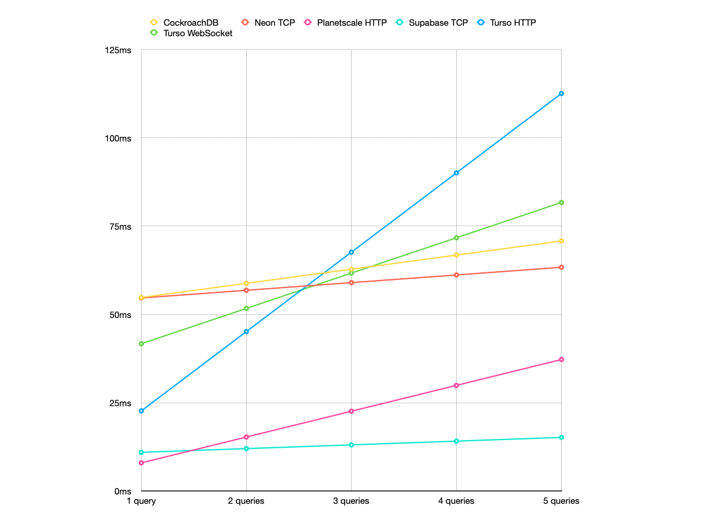

What's the fastest serverless database provider, in terms of latency?

Here, I'm defining "serverless database provider" as something that works with serverless applications without major configuration. This means traditional dedicated databases like AWS RDS are not included. Managing connection pool sucks.

I decided to focus on latency since it's a relatively objective metric that can be compared without requiring too much math or knowledge. It can be easily observed and directly affects your application's performance.

_All numbers shown are in milliseconds unless mentioned otherwise._

## Database providers

Here are the list of database providers and methods I compared. I picked these based on these conditions:

- Works with serverless out of the box (HTTP queries, built-in pooling, etc)
- Can be tested properly
- General vibes

I'm also going to compare different drivers (notably queries via HTTP vs TCP).

| Database Provider                                                  | Driver                                                           | Language         | Transaction support | Notes                                      |
| ------------------------------------------------------------------ | ---------------------------------------------------------------- | ---------------- | ------------------- | ------------------------------------------ |
| [CockroachDB](https://www.cockroachlabs.com/product/)              | `pg` driver (TCP)                                                | Cockroach        |                     |                                            |
| [Fauna](https://fauna.com)                                         | `faunadb` driver (HTTP)                                          | FQL              |                     | Hosted in United States region group       |
| [Firestore](https://firebase.google.com)                           | `firebase` SDK (HTTP)                                            | (Document based) |                     |                                            |
| [MongoDB Atlas](https://www.mongodb.com/atlas)                     | `mongodb` driver (TCP)                                           | MongoDB          |                     |                                            |
| [Neon](https://neon.tech)                                          | `@neondatabase/serverless` driver (HTTP with connection caching) | PostgreSQL       |                     |                                            |
|                                                                    | `@neondatabase/serverless` driver (WebSocket)                    |                  |                     |                                            |
|                                                                    | `pg` driver (TCP)                                                |                  |                     | Build in pooling                           |
| [PlanetScale](https://planetscale.com)                             | `@planetscale/database` driver (HTTP)                            | MySQL            |                     | No foreign key support                     |
|                                                                    | `mysql2` (TCP)                                                   |                  |                     | No foreign key support                     |
| [Supabase](https://supabase.com)                                   | `@supabase/supabase-js` client (HTTP)                            | PostgreSQL       |                     | RLS disabled                               |
|                                                                    | `pg` (TCP)                                                       |                  |                     | Built in pooling with `pgBouncer`          |
| [Turso](https://turso.tech)                                        | `libsql` (HTTP)                                                  | LibSQL (SQLite)  |                     | Transactions supported via batched queries |
|                                                                    | `libsql` (WebSocket)                                             |                  |                     |                                            |
| [Vercel Postgres](https://vercel.com/docs/storage/vercel-postgres) | `@vercel/postgres`                                               | PostgreSQL       |                     | Based on Neon                              |

In addition, I also tried out some Redis providers.

| Database Provider                                      | Driver                         | Language | Transaction support | Notes                  |
| ------------------------------------------------------ | ------------------------------ | -------- | ------------------- | ---------------------- |
| [Upstash Redis](https://upstash.com)                   | `@upstash/redis` client (HTTP) | Redis    |                     |                        |
|                                                        | `ioredis` (TCP)                |          |                     |                        |
| [Vercel KV](https://vercel.com/docs/storage/vercel-kv) | `@vercel/kv`                   | Redis    |                     | Based on Upstash Redis |

## Methodology

I created an empty database table with each provider. I will not be populating them since, again, I am testing latency, not query speeds. The database will be hosted in AWS `us-east-1` or GCP `us-east4`, and on the cheapest tier (i.e. free). The API route making the queries will also be hosted on Vercel Serverless Functions in AWS `us-east-1`.

To replicate a serverless application, I set up an API route that will make 3 consecutive "get all entries" queries. The time it took to finish each of those queries will be recorded. This API route will be called 5 times every 0.5 seconds, or 10 requests (30 database calls) per second, which I will continue for 60 seconds. In total, 600 requests and 1800 database queries will be made in a minute. This number is quite arbitrary, but that should cover anywhere from around 10k daily users (250 queries/user) to 50k daily users (50 queries/user). I also tried quadrupling the queries and results were more or less similar.

Anyway, I ruled out AppWrite Cloud since it can only be hosted in Frankfurt currently, and Xata since its rate-limiting did not allow me to make enough requests. Globally replicated databases such as Cloudflare D1/KV and Deno KV were also omitted since it's out of scope of this tests and requires a different testing approach.

I did not measure cold starts and ran a single query before running the 1800 queries to account for it.

## Some quick observations

Before we look at the numbers, here are some small observations I made. I have also omitted some databases from the final results and I included my reasons here.

### PlanetScale HTTP vs TCP

To my surprise, there weren't any differences between using PlanetScale's serverless driver and a regular MySQL driver (`mysql2`) with PlanetScale. I'd expected the TCP connection to be slow on initial queries (around 10~100ms) and super fast on subsequent queries, which were the case for every other TCP connections. However, latency were the same across the 2 query types. As such, I'll be omitting PlanetScale on TCP connections from further results since the result is nearly identical to HTTP connections.

### Issues with WebSocket connections

For both Neon and Turso on WebSocket connections, big hikes were observed for initial queries, sometimes reaching 1000ms. I'll be omitting Neon with WebSocket connections since regular TCP connections were better in all metrics, and WebSocket connections are intended for environments without TCP connections (edge functions). On the other hand, Turso with WebSocket will still be included as interactive transactions are not supported in HTTP.

##### Neon + WebSocket initial query

| Average | 99th percentile | Maximum |
| ------- | --------------- | ------- |
| 57      | 1050            | 1062    |

### Vercel

Unsurprisingly, there were no noticeable differences between Vercel Postgres and Neon, and Vercel KV and Upstash Redis. With Vercel's offering being more expensive, I don't see a single reason to use them. I think I preferred the DX of Neon and Upstash as well.

### Upstash HTTP vs TCP

While HTTP saw better initial queries, TCP saw more stable query speeds.

##### Initial query

| Name                 | Average | 90th Percentile | 95% | 99% | Maximum |
| -------------------- | ------- | --------------- | --- | --- | ------- |
| Upstash Redis (HTTP) | 5       | 6               | 13  | 79  | 109     |
| Upstash Redis (TCP)  | 7       | 12              | 15  | 32  | 79      |

##### Subsequent query

| Name                 | Average | 90th Percentile | 95% | 99% | Maximum |
| -------------------- | ------- | --------------- | --- | --- | ------- |
| Upstash Redis (HTTP) | 4       | 5               | 15  | 40  | 63      |
| Upstash Redis (TCP)  | 2       | 8               | 8   | 10  | 19      |

### Cold starts

While I did not run tests for measuring cold starts, I did run some queries manually.

Neon, which includes Vercel Postgres, seems to have cold starts usually ranging anywhere from 500ms~100ms, but sometimes nearly 3 seconds, after a few minutes of inactivity.

## Overview

The general trend is that TCP connections are fast once connected, while HTTP connections aren't as fast but provides a stable query speed all around. That said, there are some clear outliers. For one, PlanetScale and Neon are hitting sub-10ms latency, and Supabase with TCP provides both fast connections and queries. I'm also pretty impressed by CockroachDB since it doesn't use any pooling under the hood.

MongoDB Atlas has the best query speeds for subsequent queries but has abysmal initial connection time. I'm also not sure why Supabase with HTTP is slower than their competitors (Edit: It looks like the auth middleware which isn't included when used with TCP is the cause).

Keep in mind the averages has a margin of error from 1ms (for low numbers) to 10ms (for high numbers). This is based on my observations and no real calculations were done.

_In the chart below, the top bar represents the latency of initial queries, and the bottom represents the latency of subsequent queries._

##### Initial query

| Name                             | Average | 90th Percentile | 95% | 99% | Maximum |
| -------------------------------- | ------- | --------------- | --- | --- | ------- |
| CockroachDB                      | 55      | 60              | 75  | 144 | 1068    |
| Fauna                            | 44      | 52              | 69  | 114 | 129     |
| Firestore                        | 41      | 42              | 58  | 371 | 420     |
| MongoDB Atlas                    | 131     | 141             | 153 | 245 | 5122    |
| Neon (HTTP + connection caching) | 5       | 8               | 10  | 17  | 35      |
| Neon (TCP)                       | 55      | 67              | 76  | 96  | 134     |
| PlanetScale (HTTP)               | 8       | 12              | 15  | 24  | 94      |
| Supabase (HTTP)                  | 41      | 50              | 58  | 137 | 205     |
| Supabase (TCP)                   | 11      | 13              | 18  | 26  | 11      |
| Turso (HTTP)                     | 27      | 41              | 45  | 56  | 109     |
| Turso (WebSocket)                | 42      | 36              | 63  | 352 | 1530    |

##### Subsequent query

| Name                             | Average | 90th Percentile | 95% | 99% | Maximum |
| -------------------------------- | ------- | --------------- | --- | --- | ------- |
| CockroachDB                      | 4       | 4               | 5   | 9   | 14      |
| Fauna                            | 29      | 34              | 36  | 96  | 135     |
| Firestore                        | 29      | 39              | 42  | 55  | 118     |
| MongoDB Atlas                    | <1      | <1              | <1  | <1  | 14      |
| Neon (HTTP + connection caching) | 4       | 8               | 10  | 19  | 37      |
| Neon (TCP)                       | 2       | 3               | 6   | 9   | 26      |
| PlanetScale (HTTP)               | 7       | 11              | 15  | 29  | 59      |
| Supabase (HTTP)                  | 38      | 48              | 55  | 72  | 207     |
| Supabase (TCP)                   | 1       | 1               | 1   | 4   | 7       |
| Turso (HTTP)                     | 22      | 41              | 44  | 68  | 115     |
| Turso (WebSocket)                | 10      | 6               | 16  | 332 | 495     |

## Expected latency

| Name                           | Initial query | Subsequent query | 1 query | 2   | 3   | 4   | 5   |
| ------------------------------ | ------------- | ---------------- | ------- | --- | --- | --- | --- |
| CockroachDB                    | 55            | 4                | 55      | 59  | 63  | 67  | 71  |
| Fauna                          | 44            | 29               | 44      | 73  | 103 | 132 | 161 |
| Firestore                      | 41            | 29               | 41      | 70  | 99  | 127 | 156 |
| MongoDB Atlas                  | 131           | 0                | 131     | 131 | 132 | 132 | 132 |
| Neon HTTP (connection caching) | 5             | 4                | 5       | 9   | 14  | 18  | 23  |
| Neon TCP                       | 55            | 2                | 55      | 57  | 59  | 61  | 63  |
| Planetscale HTTP               | 8             | 7                | 8       | 15  | 23  | 30  | 37  |
| Supabase HTTP                  | 41            | 38               | 41      | 79  | 118 | 156 | 195 |
| Supabase TCP                   | 11            | 1                | 11      | 12  | 13  | 14  | 15  |
| Turso HTTP                     | 23            | 22               | 23      | 45  | 68  | 90  | 113 |
| Turso WebSocket                | 42            | 10               | 42      | 52  | 62  | 72  | 82  |

##### NoSQL databases

##### SQL databases

##### SQL databases with transaction support

## Conclusions

I don't think there are any wrong options per se, but I think PlanetScale and Supabase with TCP can be considered "winners." Both provide low latency without major hikes and support transactions. The ultra low latency of Neon + HTTP is impressive but I think the lack of transaction support is a big drawback, at least for me. PlanetScale also doesn't support foreign keys which may be a deal-breaker for some (though apparently it's coming _soon™_). That all being said, I think it's safe to say all 3 providers provide fast query speeds, and the performance is probably comparable (though I have no data to back that). That just leaves pricing and features which are easier to compare.

Supabase Auth (RLS) doesn't work out of the box when its used over TCP, though my opinion is that security checks should be handled by your server rather than the database. I also want to recommend libraries like [Kysely](https://kysely.dev), which makes creating queries easier without the performance implications of using hefty ORMs like Prisma (Pro tip: avoid Prisma).

I kinda wish it was easier to set up your own server, which would allow me to establish a connection once and reuse that for ultra-fast queries. Of course I'm aware that that brings its own issues, but it's definitely something I'd like to explore.
